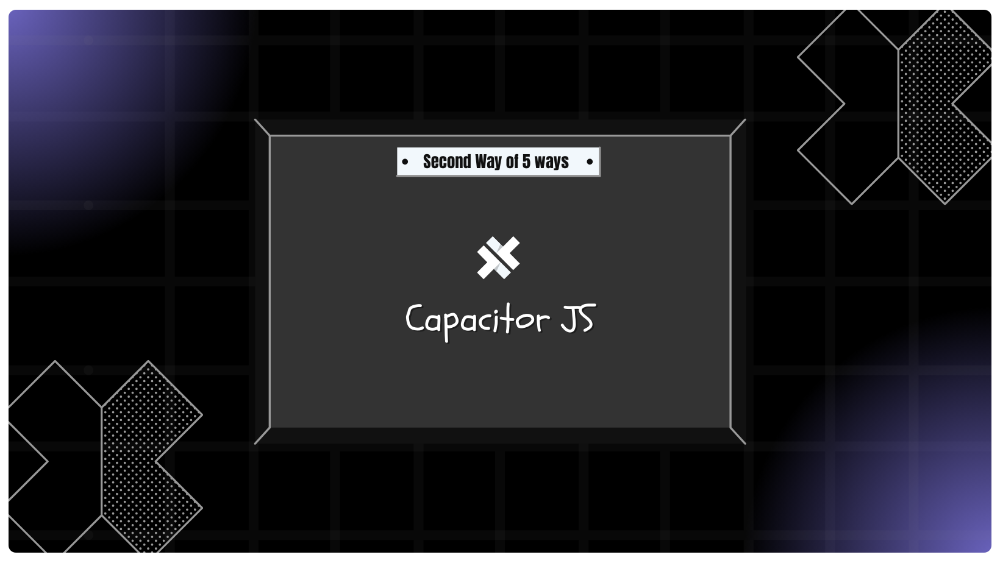
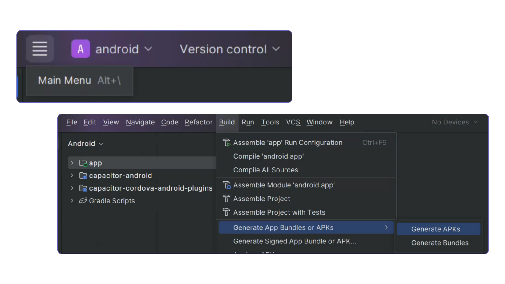

# Method 2: Capacitor App with HTML, CSS, JS - Detailed Implementation

### What is Capacitor.js?

Capacitor.js lets you wrap your web app (HTML, CSS, JS) into a native mobile app for iOS and Android.
It allows your web app to run on mobile devices, with a single codebase and easy deployment.

## Project Structure

    android/                 -> Native Android project
    node_modules/            -> Installed npm libraries
    www/                     -> Web app files
        index.html           -> Main HTML file
        style.css            -> Styles
        main.js              -> JavaScript logic
        assets/              -> Images and other assets
    capacitor.config.json    -> Capacitor configuration
    package.json             -> Project dependencies
    package-lock.json        -> Dependency lock file

## Advantages

- Single codebase for all platforms

- Easily convert any web app into a mobile app

- Simple HTML, CSS, JS structure

- Easy to maintain and update

## Limitations

- No advanced native features without plugins

- Requires Android/iOS setup for mobile builds

- Slightly bigger size than pure PWA

## Implementation Steps

### 1. Initialize NPM Project

```bash
npm init -y
```

### 2. Install Capacitor

For HTML/CSS/JS we just replace files in `www` folder:

```bash
npm install @capacitor/core @capacitor/cli
```

### 3. Initialize Capacitor:

```bash
npx cap init
```

- App name: `MyApp`

- App ID: `com.example.myapp`

- Web directory: `www` (we will create it next)

### 3. Create Web App Structure

- Create the `www` folder

  ```
    www/
    ├── index.html
    ├── style.css
    ├── main.js
    └── assets/
        └── logo-dark.webp
  ```

### 4. Install Android Platform

```bash
npm install @capacitor/android
```

### 5. Add Platform To The Project

```bash
npx cap add android
```

### 5. Build & Copy Web App

Since we are using plain HTML/JS:

```bash
npx cap copy
```

### 6. Now Build Your app on Android Studio

```bash
npx cap open android  # Android Studio
```

### 7. Build You Apk File following these pics



## Finally You Can Find Your apk file on

```bash
"/android/app/build/outputs/apk/debug"
```

## Or You just start with these files on repo :\)

## Getting Started

- Clone or download this repository

- Open project folder

- Install dependencies:

```bash
npm install
```

- Copy web files to `www` folder:

- Add Changes of Modifying Android Folder

```bash
npx cap copy
```

- Open and run native projects:

```bash
npx cap open android # or ios
```

- Build and run on device or simulator

## Developer

Created by <b><a href="https://www.linkedin.com/in/ahmed-sherif-2b6132249/">`Ahmed Sherif`</a></b>

---

<br>
<br>

# الطريقة التانية: تطبيق Capacitor بـ HTML, CSS, JS - تنفيذ مفصّل

### إيه هو Capacitor.js؟

Capacitor.js بيخليك تلفّ الويب أب بتاعك (HTML, CSS, JS) لتطبيق موبايل أصلي لـ iOS و Android.
بيخلي الويب أب يشتغل على الموبايل بكود واحد وسهل النشر.

## هيكل المشروع

    android/                -> مشروع أندرويد أصلي
    node_modules/           -> مكتبات npm اللي اتنزّلت
    www/                    -> ملفات الويب أب
        index.html          -> ملف HTML الرئيسي
        style.css           -> الستاييلات
        main.js             -> منطق JavaScript
        assets/             -> الصور والحاجات التانية
    capacitor.config.json   -> إعدادات Capacitor
    package.json            -> Dependencies المشروع
    package-lock.json       -> ملف تثبيت Dependencies

## المميزات

- كود واحد لكل المنصات

- سهل تحوّل أي ويب أب لتطبيق موبايل

- هيكل HTML, CSS, JS بسيط

- سهل الصيانة والتحديث

## القصور

- مفيش مميزات Native متقدمة من غير Plugins

- محتاج إعداد Android/iOS علشان تعمل Build للموبايل

- حجم التطبيق أكبر شوية من PWA خالص

## خطوات التنفيذ

1. إنشاء مشروع NPM

```bash
npm init -y
```

2. تثبيت Capacitor

لـ HTML/CSS/JS إحنا بنستبدل الملفات في فولدر www:

```bash
npm install @capacitor/core @capacitor/cli
```

3. تهيئة Capacitor

```bash
npx cap init
```

App name: `MyApp`

App ID: `com.example.myapp`

Web directory: `www` (هنعمله دلوقتي)

3. إنشاء هيكل الويب أب

- اعمل فولدر `www`

  ```
  www/
  ├── index.html
  ├── style.css
  ├── main.js
  └── assets/
      └── logo-dark.webp
  ```

4. تثبيت منصة أندرويد

```bash
npm install @capacitor/android
```

5. إضافة المنصة للمشروع

```bash
npx cap add android
```

6. بناء ونسخ الويب أب

```bash
npx cap copy
```

7. دلوقتي افتح التطبيق على Android Studio

```bash
npx cap open android # Android Studio
```

8. بناء ملف APK
   

## فين هتلاقي ملف الـ APK

```bash
"/android/app/build/outputs/apk/debug"
```

## أو تبدأ بالملفات الموجودة في الريبو :)

## البداية

- Clone أو نزّل الريبو

- افتح فولدر المشروع

- نزل الـ Dependencies:

```bash
npm install
```

- انسخ ملفات الويب لفولدر `www`

- اعمل أي تغييرات على فولدر Android

```bash
npx cap copy
```

- افتح وشغل المشاريع Native:

```bash
npx cap open android # أو ios
```

- اعمل Build وشغّل على الجهاز أو Simulator

## المطور الجامد جمودة

شيفو <b><a href="https://www.linkedin.com/in/ahmed-sherif-2b6132249/">`Ahmed Sherif`</a></b>

<div align="center">
 


</div>
